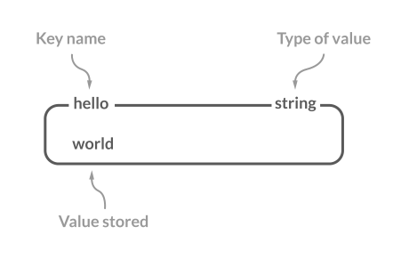
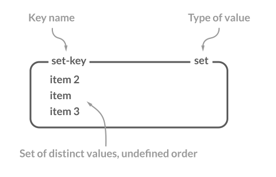

# 레디스의 자료 구조

## Strings

* 레디스에서 데이터를 저장할 수 있는 가장 간단한 자료 구조
* 최대 512MB의 문자열 데이터를 저장할 수 있음
* 이진 데이터를 포함하는 모든 종류의 문자열이 binary-safe하게 처리됨
  * JPEG 이미지와 같은 바이트 값, HTTP 응답값 등의 데이터를 저장하는 것도 가능



#### Binary-safe 란?

"Binary-safe"는 이진 데이터를 문자열로 안전하게 처리하는 것을 의미합니다. 레디스에서는 문자열 자료형을 통해 바이트 배열로 데이터를 저장하고 반환하여 이를 실현합니다. 클라이언트가 이진 데이터를 레디스에 저장하면 추가적인 처리 없이 안전하게 보존됩니다.

### 기본 명령어

* **SET** - 데이터를 저장
  * NX 옵션: 지정한 키가 없을 때에만 새로운 키를 저장, 락 구현 시 유용함
  * XX 옵션: 지정한 키가 있을 때에만 새로운 값으로 저장, 새로운 키를 생성 X
* **GET** - 데이터를 조회
* **INCR** - 숫자를 원자적(atomic)으로 증가
  * 같은 키에 접근하는 여러 클라이언트가 경쟁 상태(race condition)를 발생시킬 일이 없음을 의미
* **INCRBY** - 숫자를 원하는 만큼 증가 
* **DECR** - 숫자를 감소
* **DECRBY** - 숫자를 원하는 만큼 감소
* **MSET** - 한 번에 여러 키를 저장
* **MGET** - 한 번에 여러 키를 조회

```shell
127.0.0.1:6379> set hello world
OK

127.0.0.1:6379> get hello
"world"

127.0.0.1:6379> set hello newval NX
(nil)

127.0.0.1:6379> get hello
"world"

127.0.0.1:6379> set hi newval2 XX
(nil)

127.0.0.1:6379> get hi
(nil)

127.0.0.1:6379> mset a 10 b 20 c 30
OK

127.0.0.1:6379> mget a b c
1) "10"
2) "20"
3) "30"
```

## Lists

* 순서를 가지는 문자열의 목록
* 하나의 list에는 최대 42억여 개의 아이템을 저장할 수 있음
* Linked Lists를 통해 구현되어 있어 있어 리스트 맨 앞이나 맨 뒤에 아이템을 추가할 때는 일정한 시간으로 수행됨
* 인덱스를 이용해 데이터에 직접 접근할 수 있지만 속도가 느림
  * 큰 집합에서 중간 값에 빠른 접근이 필요할 때는 Sorted sets을 사용할 것
* 


### 기본 명령어

* **LPUSH** - list의 왼쪽에 데이터를 추가
* **RPUSH** - list의 오른쪽에 데이터를 추가
* **LRANGE** - list에 들어 있는 데이터를 조회
  * 시작과 끝 아이템의 인덱스를 각각 인수로 받아 출력
  * 가장 오른쪽(tail)에 있는 아이템의 인덱스는 -1, 그 앞의 인덱스는 -2
  * 0부터 -1까지의 아이템을 출력하라는 것은 전체 데이터를 출력하라는 의미
* **LPOP** - list에 저장된 첫 번째 아이템을 반환하는 동시에 list에서 삭제
  * 숫자와 함께 사용하면 지정한 숫자만큼의 아이템을 반복해서 반환
* **LTRIM** - 시작과 끝 아이템의 인덱스를 인자로 받아 지정한 범위에 속하지 않는 아이템은 모두 삭제, LPOP과 같이 삭제되는 아이템을 반환하지는 않음
* **LINSERT** - 원하는 데이터의 앞이나 뒤에 데이터를 추가 
  * BEFORE, AFTER 옵션을 활용
  * 지정한 데이터가 없으면 오류를 반환
* **LSET** - 지정한 인덱스의 데이터를 신규 입력하는 데이터로 변경
* **LINDEX** - 원하는 인덱스의 데이터를 확인

```shell
127.0.0.1:6379> LPUSH mylist E
(integer) 1

127.0.0.1:6379> RPUSH mylist B
(integer) 2

127.0.0.1:6379> LPUSH mylist D A C B A
(integer) 7

127.0.0.1:6379> LRANGE mylist 0 -1
1) "A"
2) "B"
3) "C"
4) "A"
5) "D"
6) "E"
7) "B"

127.0.0.1:6379> LRANGE mylist 0 3
1) "A"
2) "B"
3) "C"
4) "A"

### LPOP
127.0.0.1:6379> LPOP mylist
"A"

127.0.0.1:6379> LPOP mylist 3
1) "B"
2) "C"
3) "A"

### LTRIM
127.0.0.1:6379> LRANGE mylist 0 -1
1) "D"
2) "E"
3) "B"

127.0.0.1:6379> LTRIM mylist 0 1
OK

127.0.0.1:6379> LRANGE mylist 0 -1
1) "D"
2) "E"

### LINSERT
127.0.0.1:6379> LRANGE mylist 0 -1
1) "C"
2) "A"
3) "D"
4) "E"

127.0.0.1:6379> LINSERT mylist BEFORE A B
(integer) 5

127.0.0.1:6379> LRANGE mylist 0 -1
1) "C"
2) "B"
3) "A"
4) "D"
5) "E"

### LSET
127.0.0.1:6379> LRANGE mylist 0 -1
1) "C"
2) "B"
3) "A"
4) "D"
5) "E"

127.0.0.1:6379> LSET mylist 0 F
OK

127.0.0.1:6379> LRANGE mylist 0 -1
1) "F"
2) "B"
3) "A"
4) "D"
5) "E"

### LINDEX
127.0.0.1:6379> LRANGE mylist 0 -1
1) "F"
2) "B"
3) "A"
4) "D"
5) "E"

127.0.0.1:6379> LINDEX mylist 3
"D"
```

## Hashes

* 필드-값 쌍을 가진 아이템의 집합
  * 하나의 hash는 4,294,967,295개의 필드-값 쌍을 가질 수 있음
* 필드는 하나의 hash 내에서 유일하며, 필드와 값 모두 문자열 데이터로 저장됨
* 각 아이템마다 다른 필드를 가질 수 있으며, 동적으로 다양한 필드를 추가할 수 있음


### 기본 명령어

* **HSET** - 데이터 저장, 한 번에 여러 필드-값 쌍을 저장할 수 있음
* **HGET** - 데이터 조회, hash 자료 구조의 키와 아이템의 필드를 함께 입력
* **HMGET** - 하나의 hash 내에서 다양한 필드의 값을 조회
* **HGETALL** - 하나의 hash 내의 모든 필드-값 쌍을 차례로 반환

```shell
127.0.0.1:6379> HSET Product:123 Name "Happy Hacking"
(integer) 1

127.0.0.1:6379> HSET Product:123 TypeID 35
(integer) 1

127.0.0.1:6379> HSET Product:123 Version 2022
(integer) 1

127.0.0.1:6379> HSET Product:234 Name "Track Ball" TypeID 32
(integer) 2

127.0.0.1:6379> HGET Product:123 TypeID
"35"

127.0.0.1:6379> HMGET Product:234 Name TypeID 
1) "Track Ball"
2) "32"

127.0.0.1:6379> HGETALL Product:234
1) "Name"
2) "Track Ball"
3) "TypeID"
4) "32"
```

## Sets

* 정렬되지 않은 문자열의 모음
* 하나의 set 내에서 아이템은 중복해서 저장되지 않음



### 기본 명령어

* **SADD** - 데이터 저장, 한 번에 여러 개의 아이템을 저장할 수 있음
* **SMEMBERS** - set에 저장된 전체 아이템을 출력, 저장 순서와 관계 없음
* **SREM** - 특정 아이템을 삭제
* **SPOP** - 아이템을 랜덤으로 하나 반환하고 set에서 삭제
* **SINTER** - set에서 아이템들의 교집합
* **SUNION** - 합집합
* **SDIFF** - 차집합

```shell
127.0.0.1:6379> SADD myset A
(integer) 1

127.0.0.1:6379> SADD myset A A A B B C D D E E F F F G
(integer) 6

127.0.0.1:6379> SMEMBERS myset
1) "A"
2) "B"
3) "C"
4) "D"
5) "E"
6) "F"
7) "G"

### SREM, SPOP
127.0.0.1:6379> SREM myset B
(integer) 1

127.0.0.1:6379> SPOP myset
"C"

127.0.0.1:6379> SMEMBERS myset
1) "A"
2) "D"
3) "E"
4) "F"
5) "G"

### SINTER, SUNION, SDIFF
127.0.0.1:6379> SADD set:111 A B C D E
(integer) 5

127.0.0.1:6379> SADD set:222 D E F G H
(integer) 5

127.0.0.1:6379> SINTER set:111 set:222
1) "D"
2) "E"

127.0.0.1:6379> SUNION set:111 set:222
1) "A"
2) "B"
3) "C"
4) "D"
5) "E"
6) "F"
7) "G"
8) "H"

127.0.0.1:6379> SDIFF set:111 set:222
1) "A"
2) "B"
3) "C"

127.0.0.1:6379> SDIFF set:222 set:111
1) "F"
2) "G"
3) "H"

127.0.0.1:6379> SADD set:333 G
(integer) 1

127.0.0.1:6379> SDIFF set:222 set:111 set:333
1) "F"
2) "H"
```

## Sorted sets

## Bitmaps

## Bitfields

## HyperLogLog

## Geospatial indexes

## Streams


**참고 자료**

* [이미지 출처](https://redis.com/redis-enterprise/data-structures/)
* [takes the latest tweets](https://www.infoq.com/presentations/Real-Time-Delivery-Twitter)
* [유저 목록을 Redis Bitmap 구조로 저장하여 메모리 절약하기](https://blog.dramancompany.com/2022/10/%EC%9C%A0%EC%A0%80-%EB%AA%A9%EB%A1%9D%EC%9D%84-redis-bitmap-%EA%B5%AC%EC%A1%B0%EB%A1%9C-%EC%A0%80%EC%9E%A5%ED%95%98%EC%97%AC-%EB%A9%94%EB%AA%A8%EB%A6%AC-%EC%A0%88%EC%95%BD%ED%95%98%EA%B8%B0/)